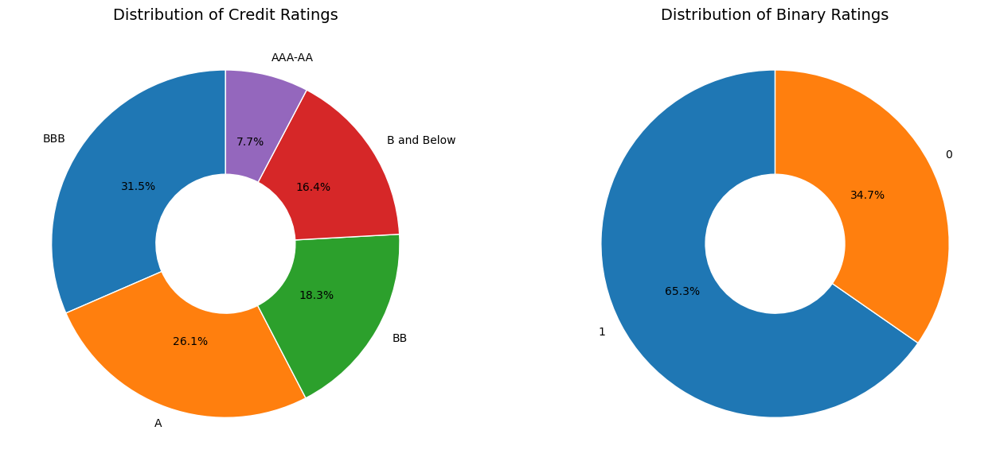
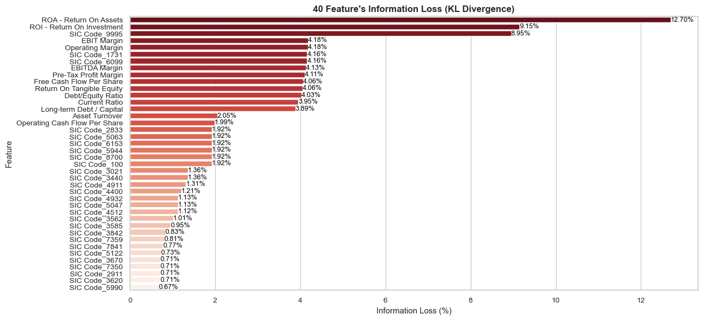
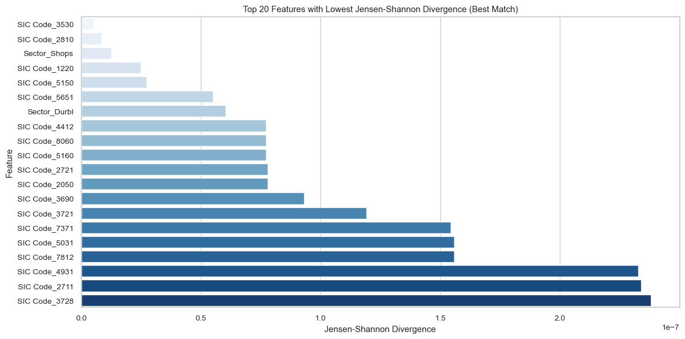

# Synthetic Data Generation and Prediction for Corporate Rating using Bayesian and MCMC Techniques

### 📌 Abstract

This project focuses on building a **rsynthetic data generation pipeline** and **Bayesian credit-rating prediction models** for corporate credit datasets.
Corporate credit rating data is often scarce, confidential, and difficult to obtain, which limits the performance of machine learning models.
To address this challenge, in this project I performed the following:

* **Gaussian Mixture Modelling**
* **Rank-based Quantile Matching**
* **MCMC-based Correlation Refinement**
* **Bayesian Logistic & Multinomial Rating Models**

to create **statistically accurate synthetic datasets** and **uncertainty-aware rating predictions**.

The final system enhances small datasets, captures uncertainty, and provides credible intervals for every prediction, making it suitable for high-risk financial modelling tasks.
In next step, for prediction of **Rating** and **credit Rating**, I used the same idea
* **monte-carlo** updataion of cost function using Bayesian method
* residual-refinement using Gaussian mixture model

  
### 📌 Problem Statement and Solution

**The Challenge:**
Corporate credit data is limited, noisy, and belongs to multiple rating agencies with inconsistent methodologies.
Traditional ML models retrain from scratch on every update and cannot quantify uncertainty — a major drawback in finance.

**My Solution:**
This project builds a comprehensive Bayesian–MCMC pipeline that:

* Generates **high-fidelity synthetic financial data**
* Preserves marginals, correlations, categorical patterns
* Utilizes **posterior predictive distributions** for classification
* Provides **95% credible intervals** per prediction
* Performs well even with limited real-world data

This enables more reliable modelling and improves generalization under data scarcity.

<!--  -->

### 📌 Introduction

This repository provides a complete framework for:
* Synthetic data generation for corporate financial ratios
* Bayesian binary and multiclass credit rating classification
* MCMC-based refinement of statistical structure
* Model comparison between classical ML and Bayesian methods
The goal is to show how **Bayesian inference and MCMC sampling significantly enhance prediction stability** in low-data, high-risk domains like credit rating.

### 📌 How It Works

The system follows a structured 4-stage pipeline:

1. **Data Preprocessing**

   * Cleaning, one-hot encoding, rating compression (24 → 5 major classes)
   * Splitting into numeric/categorical subsets

2. **Synthetic Data Generation**

   * **GMM modelling** for numeric features
   * **Component-wise categorical probability modelling**
   * **Quantile matching** to real data
   * **MCMC refinement** to repair covariance structure
   * **KL Divergence** and **Jensen–Shannon Divergence** are used to evaluate  the **distributional similarity** and **symmetry** of synthetic data  relative to the original data.

  
  

3. **Bayesian Prediction Models**

   * Binary: Bayesian logistic regression + residual GMM penalty
   * Multiclass: Bayesian multinomial logistic regression
   * Extraction of **posterior samples**, **credible intervals**, and **uncertainty-aware predictions**

4. **Model Comparison**

   * Baseline ML: Logistic Regression, Linear Discriminant Analysis
   * Proposed Bayesian models
   * Evaluation on **both real and synthetic data**

### 📌 Tools and Technologies Used

* **Programming Language:** Python
* **Data Handling:** Pandas, NumPy
* **Synthetic Modelling:** scikit-learn (GMM), SciPy, MCMC sampling
* **Bayesian Methods:** Custom Metropolis–Hastings sampler
* **Evaluation:** KL Divergence, Jensen–Shannon Similarity, F1, Accuracy
* **Visualization:** Matplotlib, Seaborn
* **Notebooks:** Jupyter Notebook

Here is the **GitHub-friendly Markdown** version of your content, cleanly structured and readable in a README:

## 📌 Model Comparison with Base Models

### 🔹 Original Data Comparison

#### Binary Rating (4 Metrics)

| Metric    | Base Model |   My Model |
| --------- | ---------: | ---------: |
| Accuracy  |     0.8430 | **0.8949** |
| Precision |     0.8589 | **0.9388** |
| Recall    |     0.9143 | **0.9008** |
| F1 Score  |     0.8857 | **0.9194** |

#### Multiclass Rating (1 Metric)

| Metric   | Base Model |   My Model |
| -------- | ---------: | ---------: |
| Accuracy |     0.5586 | **0.5452** |

### 🔹 Synthetic Data Comparison

#### Binary Rating (4 Metrics)

| Metric    | Base Model |   My Model |
| --------- | ---------: | ---------: |
| Accuracy  |     0.7809 | **0.8077** |
| Precision |     0.7955 | **0.8971** |
| Recall    |     0.8959 | **0.7981** |
| F1 Score  |     0.8427 | **0.8447** |

#### Multiclass Rating (1 Metric)

| Metric   | Base Model |   My Model |
| -------- | ---------: | ---------: |
| Accuracy |     0.4850 | **0.4795** |

### 📌 Results Summary

* **Binary Bayesian model** outperforms classical Logistic Regression
* **Synthetic data closely matches** real data distributions
* **Multiclass performance is lower** mainly due to inconsistent rating styles across agencies
  * A dataset from a **single agency** would significantly improve multiclass performance
* **Credible intervals** allow uncertainty-aware decision-making
* Final pipeline is robust, extensible, and suitable for financial risk modelling

---

## 🤝 Let’s Connect!

If you're interested in Bayesian modelling, synthetic data, credit risk, or MCMC techniques — feel free to reach out anytime!

**Happy to collaborate, discuss ideas, or extend this work further 🚀**

